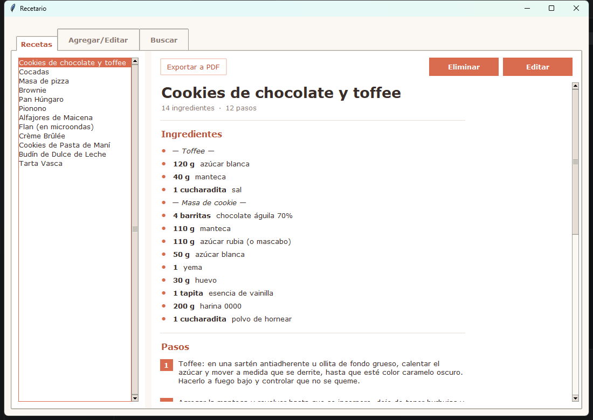
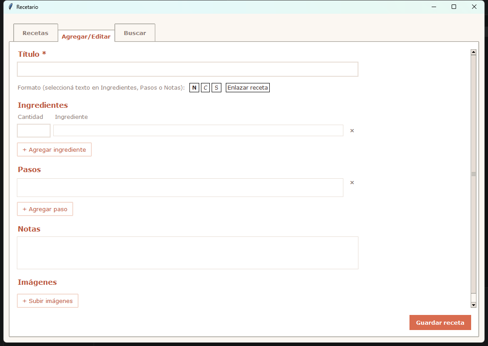
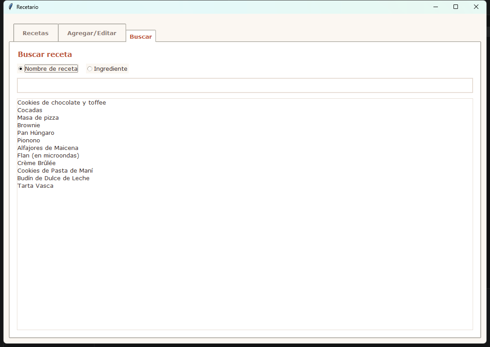
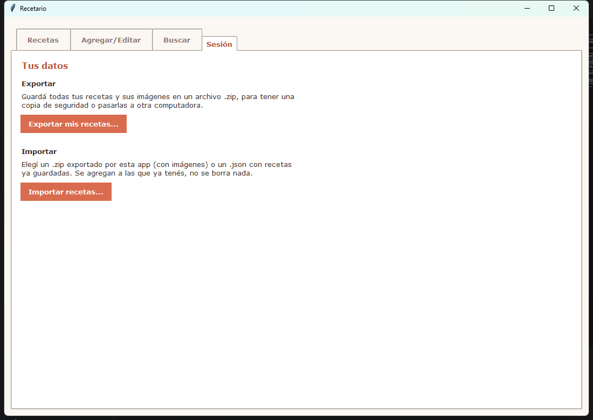

# Recetario

Aplicación para guardar, editar y buscar tus recetas de cocina, hecha en Python con tkinter.

<p align="center">
  <a href="https://github.com/cpiccin/Recetario/releases/latest/download/Recetario.exe">
    
  </a>
</p>

<p align="center">
  
</p>

## Funcionalidades

- **Ver recetas**: lista de todas tus recetas: ingredientes, pasos, notas e imágenes.
- **Agregar y editar**: formulario con ingredientes y pasos.
- **Formateo de texto**: negrita, cursiva y subrayado en ingredientes, pasos y notas.
- **Enlaces entre recetas**: enlaza una receta desde el texto de otra y navega hacia ella haciendo click.
- **Imágenes**: subí una o varias fotos por receta, se ven en miniatura y se pueden ampliar con navegación entre ellas.
- **Buscador**: por nombre de receta o por ingrediente.
- **Exportar a PDF**: todas las recetas o solo las que se elija, cada una en su propia página.
- **Exportar/Importar recetas**: permite descargar en un .zip el json de recetas y las imagenes, e importar recetas en el mismo formato.


| Recetas | Agregar / Editar | Buscar | Sesión |
|---|---|---|---|
|  |  |  |  |

## Instalación

**Windows, sin instalar nada:** descargá [Recetario.exe](https://github.com/cpiccin/Recetario/releases/latest/download/Recetario.exe), guardalo en una carpeta y ejecutalo. No necesita Python instalado.

**Desde el código fuente** (requiere Python 3.10+):

```bash
pip install -r requirements.txt
```

## Uso

```bash
python main.py
```
